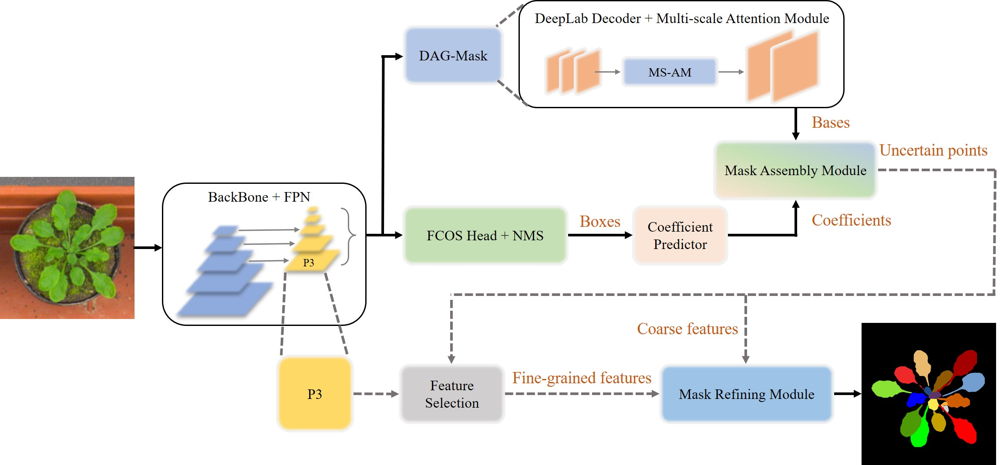

# LeafMask: Towards Greater Accuracy on Leaf Segmentation [ICCV 2021 workshop, CVPPA]

[](https://paperswithcode.com/sota/instance-segmentation-on-leaf-segmentation?p=leafmask-towards-greater-accuracy-on-leaf)

By [Ruohao Guo](https://github.com/easton-cau), [Liao Qu](https://github.com/QuLiao1117), Dantong Niu, Zhenbo Li, Jun Yue

## Introduction

This is the official implementation of the core code of [LeafMask paper](https://arxiv.org/abs/2108.03568).



We validate our LeafMask through extensive experiments on Leaf Segmentation Challenge (LSC) dataset. Our proposed model achieves the 90.09% BestDice score outperforming other state-of-the-art approaches.

## Citation
Please consider citing our paper in your publications if the project helps your research. BibTeX reference is as follow.

```
@inproceedings{guo2021leafmask,
  title={LeafMask: Towards Greater Accuracy on Leaf Segmentation},
  author={Guo, Ruohao and Qu, Liao and Niu, Dantong and Li, Zhenbo and Yue, Jun},
  booktitle={Proceedings of the IEEE/CVF International Conference on Computer Vision},
  pages={1249--1258},
  year={2021}
}
```

